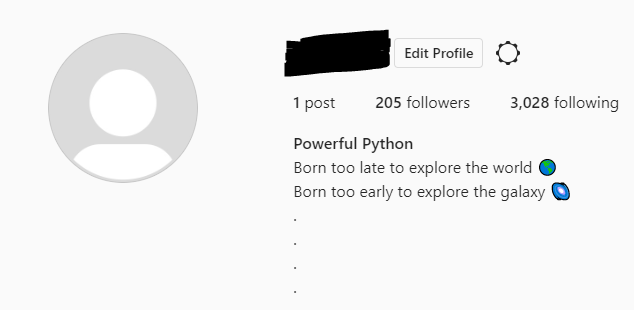
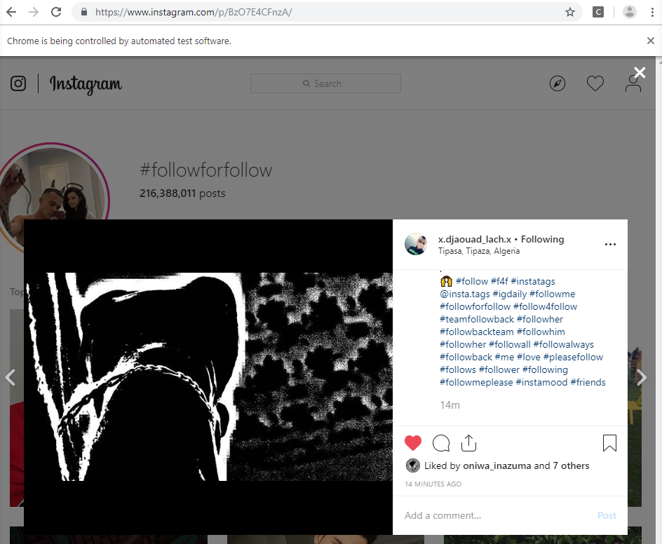
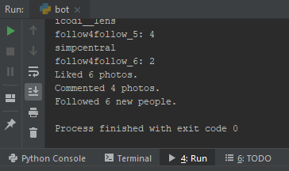
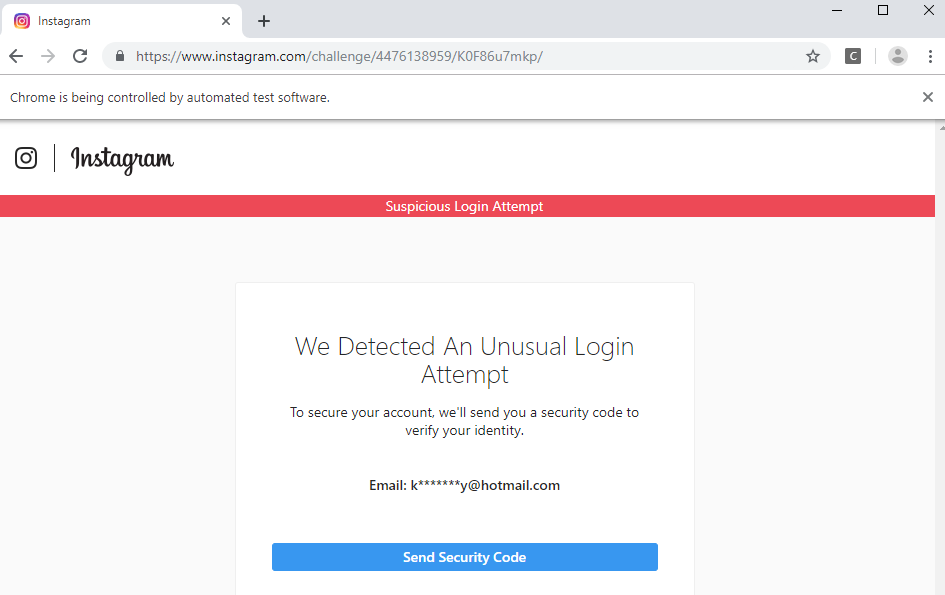
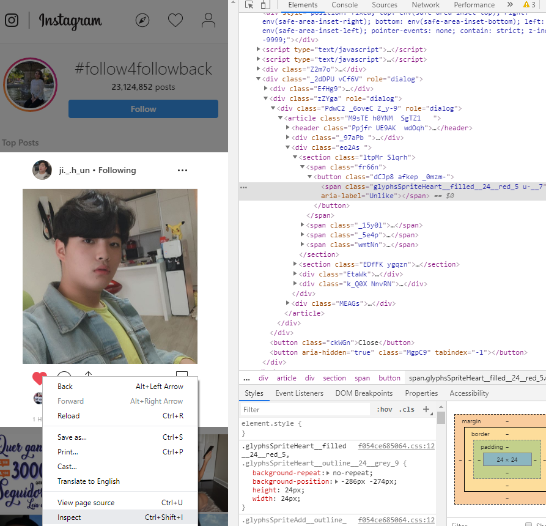
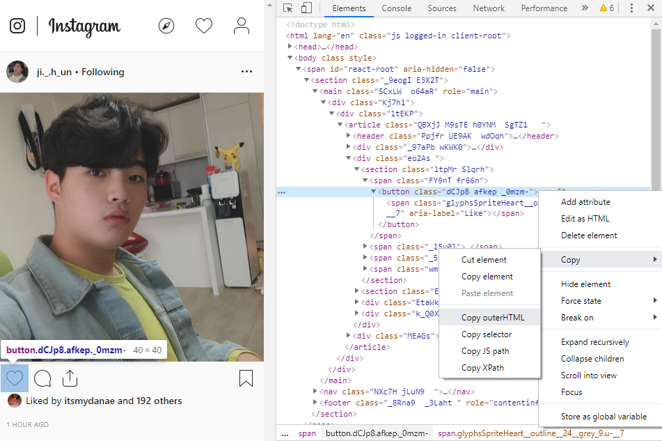
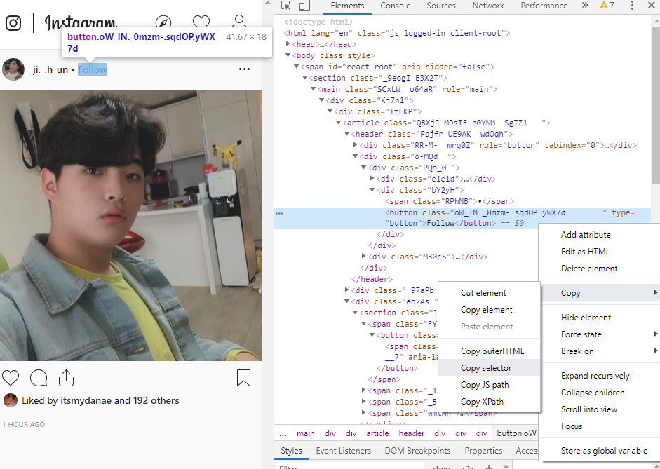
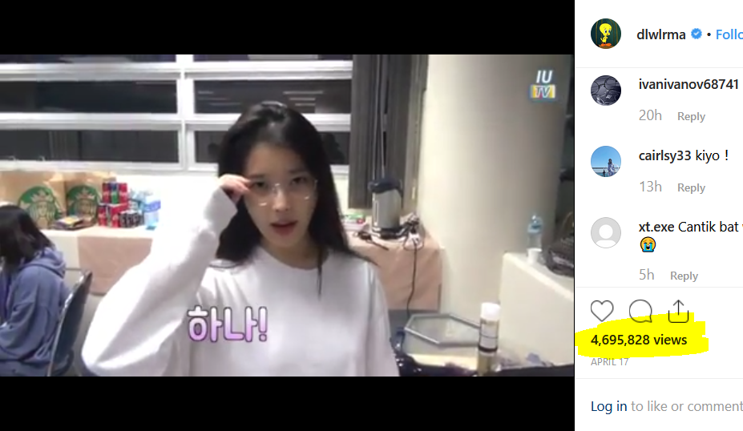

# ig-bot: Find New Followers on Instagram!
This program will automate the process of liking posts, posting comments, and following Instagram accounts who have created posts with user-specified hashtags. Through "interacting" with other Instagram accounts, users will see a gradual increase in likes and followers. 

It is important to note that if you care about your followers to following ratio, you should probably avoid using this program with your personal Instagram account. I created a seperate account to test the program out and the ratio was not the best. However, if you just want to grow your list of followers, you could run this in the background while you work on other tasks for a few hours everyday and you will grow your followers gradually over time.

The ratio could change depending on the hashtags you interact with, but I found that I got one new follower for every ten accounts I followed. I did not take a screenshot at the time, and unfortunately some of the accounts have unfollowed me. This is what my account looked like after a few weeks of inactivity: 

## Getting Started
This is a Python program written in Python 3.7.2. 
### Prerequisites
* You should have a version of Python 3 installed, and a way to run .py files.
  * 
* You need to have Google Chrome installed
  * 
* You need to have ChromeDriver downloaded
  * 
### Dependencies
Selenium: Run `pip install selenium` in your command line.
### Finish Setting Up
bot.py - Line 7: put the file path to the chromedriver.exe file that you downloaded 
bot.py - Line 14 & 16: replace the strings with your Instagram username and password 
bot.py - Line 24: comment out this line if your account has not been flagged for suspicious login attempt 
bot.py - Line 31: add hashtags you are interested in interacting with into the array 
### Running bot.py
If everything goes smoothly, bot.py should log you in automatically. It is set to pause for a random interval of time every few actions so that its actions seem more "humanlike". After logging in, your account should navigate itself to the first hashtag in your hashtag_list, and begin the process of following, liking, and commenting. Google Chrome will have a notification alerting you that it is being controlled by automated test software. It will look something like this: 
 
You should see something like this at the end: 
 
If you look in the directory/folder where bot.py is saved, you will find the followedlist.txt file. It will contain a list of users you have followed in plaintext, seperated by commas. If you plan on making use of the list to avoid interacting with accounts that you have already interacted with, make sure you keep this file in the same directory as bot.py! It should look something like this: 
 
### Troubleshooting
The first hurdle I ran into was my login attempts being flagged as suspicious. It took me to this page: 
 
This caused bot.py to crash, since it directed me to an unexpected page. In order to get around this, I added `input("Press Enter to continue...")` on line 24. After getting the security code and logging in successfully, press Enter to continue running bot.py as intended. 

The second major issue is that Instagram consistently updates its web design every couple weeks. This means that we have to manually locate the xpath or css selector for the elements we need and adjust the code in bot.py manually. What we need to do is inspect the element that we need (follow button, like button, etc.), and inspect it. Inside the HTML code, we can copy the selector or xpath depending on what bot.py requires for that element, and replace the existing code with the updated version.

In short, we must right click -> inspect element -> locate button -> copy selector/xpath. Here is a visual guide: 
 
 
 
## Success!
I ran bot.py for ~20-25 minutes while I was adding comments and tidying up the code. Within a couple hours, I had a handful of notifications on my phone! 
 
## Future Considerations
### Followers & Unfollowers
If you use your browser to access your followers and people you following, upon inspecting the page source you will see that all your followers are stored inside html list tags. Using a for-loop, we should be able to create two seperate lists and compare your list of followers to your list of users that you follow. We can then write and save it to a .txt or .csv file and use it to compare progress.
  
Once we have these lists, we should be able to use Selenium to locate the follow button on the page and automate the process of unfollowing accounts which are not following back.
### Video Views

As we can see in the highlighted part of the image above, Instagram counts views instead of likes for video posts. In order to boost views on a video, the sign up and logging in should be automated so that program can navigate itself to the video and play it. However, I can foresee potential problems getting by Instagram's suspicious login activity checker.
### Progress Tracker
If we create lists of followers and output them to .csv or .txt file with a time and date every time the program runs, we can use this data to track and graph the growing number of followers using something like Matplotlib (https://matplotlib.org/) or Plotly (https://plot.ly/python/getting-started/).
### GUI
The program has one .py file and is simple enough to not require a GUI, but if some of these future considerations are implemented, a GUI could be useful for users to select which function they wish to run instead of having to go through the code.
## Acknowledgments
A big thank you to Fábio Neves for sharing his idea and making it available, it has become the foundation of this project. His blog post is found here: https://towardsdatascience.com/increase-your-instagram-followers-with-a-simple-python-bot-fde048dce20d
